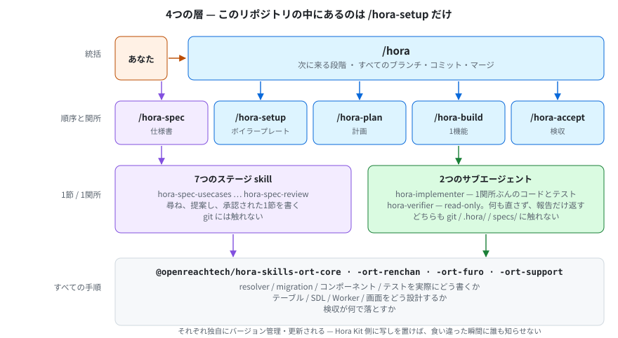

<!-- English: [architecture.md](./architecture.md) — 片方を直したら、同じコミットでもう片方も直してください -->

# この boilerplate から作ったプロジェクトが持つもの

*[English](./architecture.md)*

このリポジトリは、プロジェクトを取り巻くキットです。仕様書、実行の記録、スタック・ハンドブック、そして自前の skill を1つ持ちます。それ以外はすべて npm パッケージとして届き、`.claude/` に配置されます。

**オーケストレーターが実際にどう走るか — 18の関所、再入、git モデル、仕様の7ステージ — は `hora-core` の [`architecture.ja.md`](https://github.com/openreachtech/hora-core/blob/main/docs/architecture.ja.md) にあります。** この文書が説明するのは、あなたのプロジェクトに何が入っていて、その各部分がどこから来たか、です。

---

## 4つの層



| 層 | 決めること | 決してしないこと | 配布元 |
|---|---|---|---|
| `/hora` | 次にどの段階が来るか。すべてのブランチ・コミット・マージ | 作業の中身に関する一切 | `@openreachtech/hora` |
| 5つの skill | 作業の順序と、各関所の終了条件 | その書き方 | `@openreachtech/hora`、および このリポジトリの `/hora-setup` |
| ステージ skill と2つの agent | 仕様書の1節、あるいは1関所ぶんのコードや判定 | 順序上の位置。git に関する一切 | `@openreachtech/hora` |
| 4つのスキルパッケージ | **すべての手順と、すべての合否基準** | それが呼ばれる時機 | `@openreachtech/hora-skills-ort-core`・`-ort-renchan`・`-ort-furo`・`-ort-support` |

**この4層のうち skill 1つだけがここで書かれ、残りはパッケージとして届きます。** `/hora-setup` は `kit/skills/` でこのリポジトリが書きます。やることが最初から最後までこのスタックの話 — どのリポジトリが要るか、何がそれを満たすか、届いた後に何を読むか — であり、スタックを知らないパッケージには持てないからです。

**そして、4つの層のどれにも属さない skill が1つあります：`/hora-hotfix`。** `/hora` が決して起動しない唯一の skill です。何を緊急とするかの判断は人が下すものだからです。直接呼び出され、リリースラインではなく `main` の上で作業し、`/hora` は開いているリリースラインをその結果の上に rebase します。配布元は他と同じ `@openreachtech/hora` です。経路の全体は `hora-core` の [`hotfix.ja.md`](https://github.com/openreachtech/hora-core/blob/main/docs/hotfix.ja.md) にあります。

**キットとスキルパッケージの分担は、いちばん意外に思われるところです。** Hora Kit には resolver・migration・コンポーネントの書き方が一切なく、あってはなりません。それらは独自にバージョン管理・更新されるパッケージのものです。キット側に写しを置けば、そのパッケージが動いた瞬間に原本と食い違い、しかも誰もそれを知らせません。[`skills.ja.md`](./skills.ja.md) を参照してください。

---

## リポジトリの中身

```
specs/<version>/spec.md           何を作るか。人間と、人間に代わって書く2つの skill が書く

.hora/                            何が走ったかの記録 — 状態そのものと、その履歴
docs/                             この文書群
docs/stack/                       スタック・ハンドブック：宣言された行をどの boilerplate が
                                  満たし、何を埋め、届いた後に何を読むか
kit/skills/hora-setup/            このリポジトリが自分で書く唯一の skill
kit/scripts/equip-own-skills.mjs  その skill を、パッケージの後に .claude/ へ配置する

.claude/                          npm install が生成。git 管理外で、ここでは編集しない
```

`git log .hora/` が、何が走ったかの履歴です。他に記録している場所はなく、その必要もありません。

### `.claude/` は生成物で、ignore は許可リスト方式

`npm install` が `hora:init` を走らせ、`@openreachtech/hora` と4つのスキルパッケージを配置し、最後にこのリポジトリ自身の skill を置きます（上書きされないため）。そこに着地するのはプロジェクトのソースではなく各パッケージのビルド成果物なので、`.gitignore` は2つのペイロードディレクトリを丸ごと無視し、リポジトリのものだけを名指しで戻します。

**この向きは意図的です。** 各パッケージが配布する名前はリリースごとに変わるので、今日の名前に対して書いた拒否リストは、黙って古くなります。そして「一致しなくなった拒否リスト」は、一致しなくなったことを何も告げません — 配置された項目が、ただ静かにコミットされ始めるだけです。許可リストなら、その壊れ方はしません。

各インストーラは自分が置いたものを `.hora/<パッケージ名>.json` に記録し、次の実行はそれだけを削除してから新しくコピーします。この記録も ignore 対象です。プロジェクトの状態ではなく、インストーラの状態だからです。

### 誰が何を書いてよいか

| ディレクトリ | 書くもの | それ以外 |
|---|---|---|
| `specs/` | **人間**と、人間に代わって書く2つの skill：`/hora-spec`（承認された1節ずつ）、`/hora-plan`（承認された1編集ずつ） | 読み取りのみ |
| `.hora/` | その作業を記録する skill と、導出する1つのダイジェストを書く `hora-digester`。加えて各パッケージのインストーラが、自分の記録だけを書く | 人間は読むだけ |
| 実装リポジトリ | 作成して値を埋める `/hora-setup`、1関所ぶんのコードとテストを書く `hora-implementer`、そして git 操作すべてを担うメインセッション | — |

**守られているのは「書く行為」ではなく、「人間がその文言を実際に読まないまま、要件が `specs/` に入ることは決してない」ということです。**

---

## 次に読むもの

| | |
|---|---|
| オーケストレーターの走り方（全体） | `hora-core` の [`architecture.ja.md`](https://github.com/openreachtech/hora-core/blob/main/docs/architecture.ja.md) |
| 各コマンドが何をしているか | `hora-core` の [`commands.ja.md`](https://github.com/openreachtech/hora-core/blob/main/docs/commands.ja.md) |
| 関所が委譲するスキル | [`skills.ja.md`](./skills.ja.md) |
| このリポジトリが自分で書く skill | [`hora-setup.ja.md`](./hora-setup.ja.md) |
| 既存プロジェクトへの適用 | `hora-core` の [`adopting.ja.md`](https://github.com/openreachtech/hora-core/blob/main/docs/adopting.ja.md) |
| `main` の不具合が待てないときの緊急経路 | `hora-core` の [`hotfix.ja.md`](https://github.com/openreachtech/hora-core/blob/main/docs/hotfix.ja.md) |
| この boilerplate が宣言するスタック | `docs/stack/` の [`README.ja.md`](./stack/README.ja.md) |
| 18の関所そのもの | `hora-core` の [`checkpoints.md`](https://github.com/openreachtech/hora-core/blob/main/kit/skills/hora-build/references/checkpoints.md) |
| 仕様書の書式 | `hora-core` の [`spec-format.md`](https://github.com/openreachtech/hora-core/blob/main/kit/skills/hora/references/spec-format.md) |

<!-- ./images/ の図は x.svg と x.ja.svg の対で生成されています。片方を直したら、もう片方も直してください。 -->
