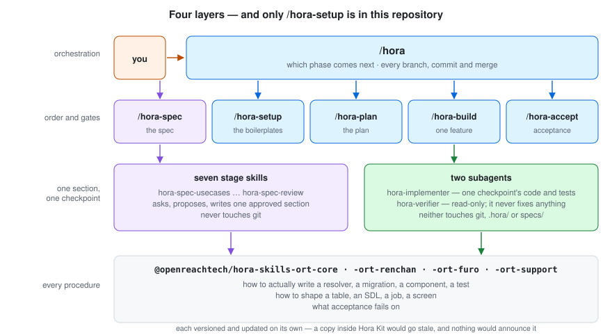

<!-- 日本語版: [architecture.ja.md](./architecture.ja.md) — 片方を直したら、同じコミットでもう片方も直してください -->

# What a project built from this boilerplate holds

*[日本語](./architecture.ja.md)*

This repository is the kit that sits around a project: it carries the spec, the record of what ran, the stack handbook, and one skill of its own. Everything else arrives as an npm package and lands under `.claude/`.

**How the orchestrator actually runs — the eighteen checkpoints, re-entrancy, the git model, the seven spec stages — is [`architecture.md`](https://github.com/openreachtech/hora-core/blob/main/docs/architecture.md) in `hora-core`.** This document is about what a project of yours contains, and where each part of it comes from.

---

## Four layers



| Layer | What it decides | What it never decides | Ships in |
|---|---|---|---|
| `/hora` | which phase comes next; every branch, commit and merge | anything about the work itself | `@openreachtech/hora` |
| the five skills | the order of the work, and each gate's exit condition | how any of it is written | `@openreachtech/hora`, and `/hora-setup` from this repository |
| the stage skills and the two agents | one section of the spec, or one checkpoint's code or verdict | where they run in the order; anything about git | `@openreachtech/hora` |
| the four skills packages | **every procedure and every pass/fail criterion** | when it is invoked | `@openreachtech/hora-skills-ort-core`, `-ort-renchan`, `-ort-furo`, `-ort-support` |

**One skill of those layers is written here, and the rest arrive as packages.** `/hora-setup` is authored in this repository, under `kit/skills/`, because its whole content is this stack — which repositories exist, what fills them, what to read once they arrived — and a package that knows no stack cannot hold it.

**And one skill sits outside all four: `/hora-hotfix`.** It is the only one `/hora` never starts, because whether something is an emergency is a person's call. It is invoked directly, it works on `main` rather than on a release line, and `/hora` rebases the open release lines onto what it produced. It ships in `@openreachtech/hora` like the rest — [`hotfix.md`](https://github.com/openreachtech/hora-core/blob/main/docs/hotfix.md) in `hora-core` has the whole route.

**The split between the kit and the skills packages is the one that surprises people.** Hora Kit contains no instructions for writing a resolver, a migration or a component, and it must not: those live in packages versioned and updated on their own. A copy inside the kit would disagree with the original the first time that package moved, and nothing would announce that it had. See [`skills.md`](./skills.md).

---

## What is in the repository

```
specs/<version>/spec.md           what gets built. Written by humans, and by the two
                                  skills that write on their behalf

.hora/                            the record of what ran — the state, and its history
docs/                             these documents
docs/stack/                       the stack handbook: which boilerplate fills a declared
                                  row, what gets filled in, what to read once it arrived
kit/skills/hora-setup/            the one skill this repository authors
kit/scripts/equip-own-skills.mjs  places that skill into .claude/ after the packages

.claude/                          generated by npm install. Ignored, never edited here
```

`git log .hora/` is the history of what ran. Nothing else records it, and nothing needs to.

### `.claude/` is generated, and the ignore rules are an allowlist

`npm install` runs `hora:init`, which equips `@openreachtech/hora` and the four skills packages, then places this repository's own skill last so nothing overwrites it. What lands there is build output of those packages rather than source of your project, so `.gitignore` ignores both payload directories whole and names back in whatever belongs to the repository.

**The direction of that rule is deliberate.** What each package distributes changes with every release, so a denylist written against today's names goes stale without saying so — and a denylist that stops matching says nothing when it stops: every equipped entry would simply start being committed. An allowlist cannot fail that way.

Each installer records what it placed in `.hora/<package name>.json`, so the next run removes exactly that before copying fresh. Those records are ignored too: they are state of the installer, not of the project.

### Who may write what

| Directory | Written by | Everyone else |
|---|---|---|
| `specs/` | **humans**, and the two skills that write on their behalf: `/hora-spec`, one approved section at a time, and `/hora-plan`, one approved edit at a time | read-only |
| `.hora/` | the skill whose work it records, and `hora-digester` for the one digest it derives — plus the package installers, each writing only its own record | humans read only |
| the implementation repositories | `/hora-setup` as it creates and fills them, `hora-implementer` for one checkpoint's code and tests, and the main session for every git operation | — |

**What is protected is not the act of writing — it is that no requirement ever enters `specs/` without a human having read the exact words first.**

---

## Where to go next

| | |
|---|---|
| how the orchestrator runs, in full | [`architecture.md`](https://github.com/openreachtech/hora-core/blob/main/docs/architecture.md) in `hora-core` |
| what each command does, step by step | [`commands.md`](https://github.com/openreachtech/hora-core/blob/main/docs/commands.md) in `hora-core` |
| the skills the checkpoints delegate to | [`skills.md`](./skills.md) |
| the skill this repository authors | [`hora-setup.md`](./hora-setup.md) |
| putting this on a project that already exists | [`adopting.md`](https://github.com/openreachtech/hora-core/blob/main/docs/adopting.md) in `hora-core` |
| the emergency route, when something on `main` cannot wait | [`hotfix.md`](https://github.com/openreachtech/hora-core/blob/main/docs/hotfix.md) in `hora-core` |
| the stack this boilerplate declares | [`README.md`](./stack/README.md) under `docs/stack/` |
| the eighteen checkpoints themselves | [`checkpoints.md`](https://github.com/openreachtech/hora-core/blob/main/kit/skills/hora-build/references/checkpoints.md) |
| the format of a spec | [`spec-format.md`](https://github.com/openreachtech/hora-core/blob/main/kit/skills/hora/references/spec-format.md) |

<!-- The figures in ./images/ are generated in pairs — x.svg and x.ja.svg. Edit one and edit the other. -->
